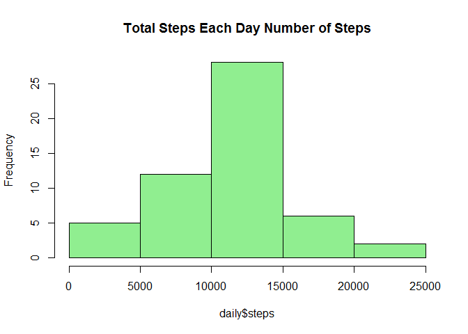
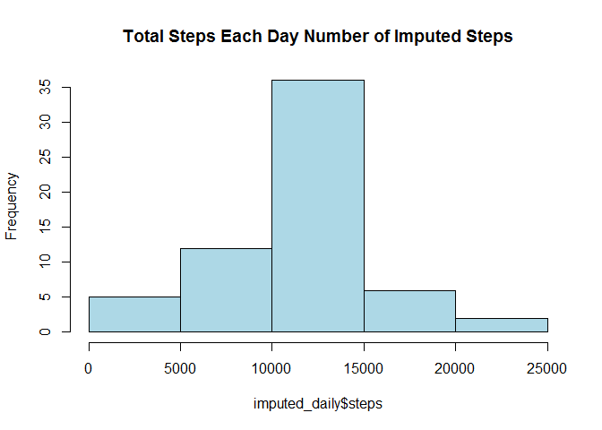

# Reproducible Research: Peer Assessment 1
Trey Storer  
December 15, 2015  
#About
This R Markdown document will complete the work necessary for submission of Assignment 1 of Reproducible Research measuring the results of step tracking devices in five minute intervals over two days.


```r
echo=TRUE
options(scipen = 1)
```


##Loading and Preprocessing the data:
Connect to the data, download, unzip and read the raw data


```r
setwd("C:/Users/sc58263/Documents/Coursera/ReproducibleResearch")
if(!file.exists("getdata-projectfiles-UCI HAR Dataset.zip")) {
  temp <- tempfile()
  download.file("http://d396qusza40orc.cloudfront.net/repdata%2Fdata%2Factivity.zip",temp)
  unzip(temp)
  unlink(temp)
}

activity <- read.csv("activity.csv")

str(activity)
```

```
## 'data.frame':	17568 obs. of  3 variables:
##  $ steps   : int  NA NA NA NA NA NA NA NA NA NA ...
##  $ date    : Factor w/ 61 levels "2012-10-01","2012-10-02",..: 1 1 1 1 1 1 1 1 1 1 ...
##  $ interval: int  0 5 10 15 20 25 30 35 40 45 ...
```

Based on the results of the data structure, it is clear the dates were not formatted correctly. So, we will correct that:


```r
activity$date<- as.Date(activity$date)
str(activity)
```

```
## 'data.frame':	17568 obs. of  3 variables:
##  $ steps   : int  NA NA NA NA NA NA NA NA NA NA ...
##  $ date    : Date, format: "2012-10-01" "2012-10-01" ...
##  $ interval: int  0 5 10 15 20 25 30 35 40 45 ...
```

```r
rmactivity<- activity[which(!is.na(activity$steps)),]
```

##Calculate and plot the histogram for the steps taken per day.


```r
daily <- aggregate(steps ~ date, activity, sum)
hist(daily$steps, col= "lightgreen", main = paste("Total Steps Each Day", ylab = "Number of Steps"))
```

 


```r
stepmean<- mean(daily$steps)
stepmedian<- median(daily$steps)
```

The mean is 10766.1886792 and the median is10765.

##What is the average daily activity pattern?
* Calculate the average steps per interval
* Plot the average steps per interval
* Find the interval with the highest number of steps


```r
intervalsteps <- aggregate(steps ~ interval, rmactivity, mean)
plot(intervalsteps$interval,intervalsteps$steps, type="l", xlab="Interval", ylab="Number of Steps",main="Average Number of Steps per Day by Interval")
```

 

```r
max_interval <- intervalsteps[which.max(intervalsteps$steps),1]
max_steps <- intervalsteps[which.max(intervalsteps$steps),2]
```

The maximum average steps in any interval is 206.1698113, occurring at 835.

##Imputing Missing Values
There are many records with missing values, so we need to be sure that the reporting is not adversely affected by these gaps.
As a reminder, let's check the number of missing values in the steps columns.

```r
sum(is.na(activity$steps))
```

```
## [1] 2304
```
Further, we will check the missing values overall to ensure we have found all of the missing values.

```r
sum(is.na(activity))
```

```
## [1] 2304
```

Now, we will create a strategy to impute the number of steps for each interval with missing values.  We will use the mean of the steps for matching intervals across the days with valid measurements.


```r
imputed_data <- transform(activity, steps = ifelse(is.na(activity$steps), intervalsteps$steps[match(activity$interval, intervalsteps$interval)], activity$steps))
sum(is.na(imputed_data))
```

```
## [1] 0
```

There are no longer any missing values.

Generate a new Histogram based on the data with imputed values in place of the missing values.


```r
imputed_daily <- aggregate(steps ~ date, imputed_data, sum)
hist(imputed_daily$steps, col= "lightblue", main = paste("Total Steps Each Day", lab = "Number of Imputed Steps"))
```

 

We should compare the old values with the new Imputed values to see how our effort changed the results.

Calculate the new mean and median:

```r
imputed_mean<- mean(imputed_daily$steps)
imputed_median<- median(imputed_daily$steps)
```

The new, imputed mean is 10766.1886792, and the new imputed medians is 10766.1886792.


```r
mean_var<- imputed_mean - stepmean
med_var<- abs(imputed_median - stepmedian)
```

The impact was minimal.  The variance between the old and new mean was 0 steps and the variance between the medians was 1.1886792 steps.

## How does activity change based on the day of the week, particularly between weekdays and weekends?

We will assign our records to either weekday or weekend based on the date the information was recorded, then summarize the results by day of the week and interval.


```r
weekdays <- c("Monday", "Tuesday", "Wednesday", "Thursday", 
              "Friday")
imputed_data$dow = as.factor(ifelse(is.element(weekdays(as.Date(imputed_data$date)),weekdays), "Weekday", "Weekend"))

steps_by_interval_i <- aggregate(steps ~ interval + dow, imputed_data, mean)

library(lattice)

xyplot(steps_by_interval_i$steps ~ steps_by_interval_i$interval|steps_by_interval_i$dow, main="Average Steps per Day by Interval",xlab="Interval", ylab="Steps",layout=c(1,2), type="l")
```

 

It appears that activity starts earlier on weekdays, but stays at a higher leverl throughout the day on weekends.

